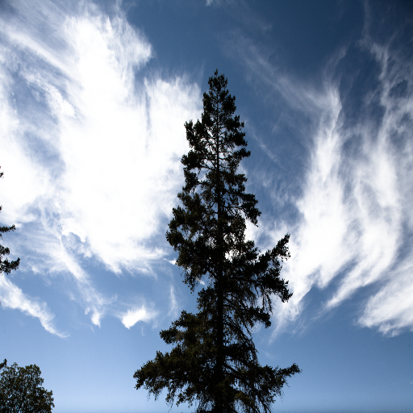
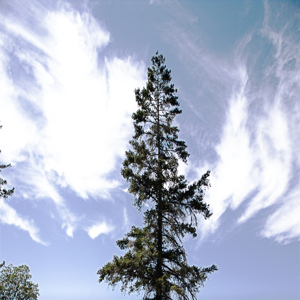
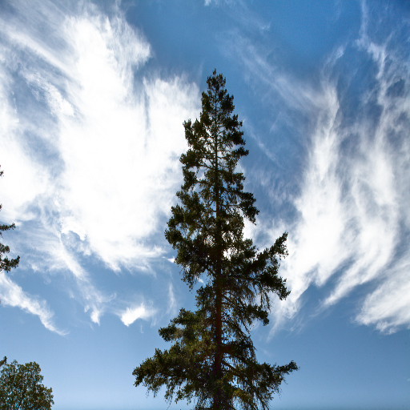
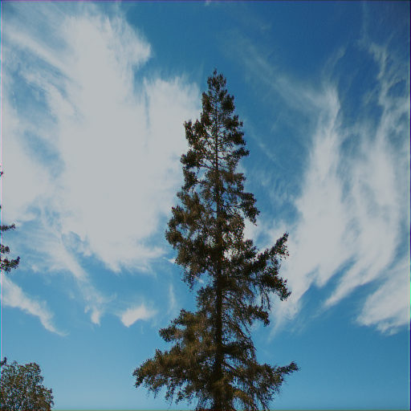
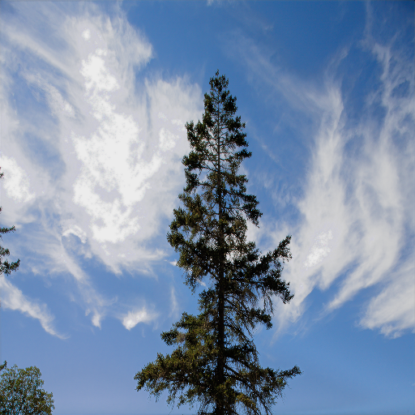
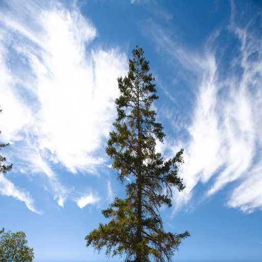
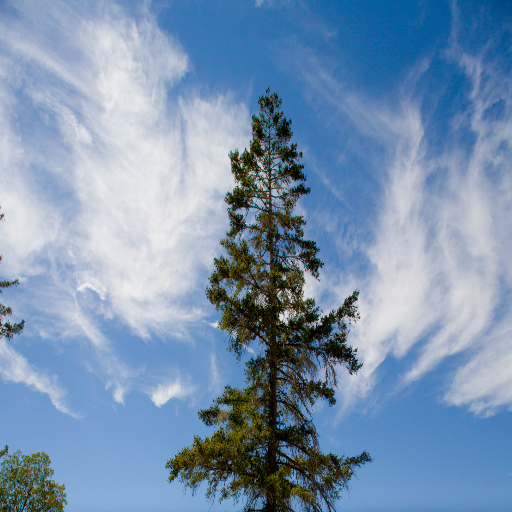

## 🤓 Qualitive comparison
|　Input　|　Zero-DCE　|*EnGAN|　IAT　|LCDP|　Ours　|　GT　|
|---|---|---|---|---|---|---|
||||||||

*EnlightenGAN

**Abstract:** 
Exposure correction plays a crucial role in computer vision, influencing the quality and usability of images. Traditional image processing techniques such as histogram equalization and gamma correction have evolved into more sophisticated deep learning-based methodologies. In this paper, we propose a novel method for exposure correction that effectively addresses the challenges posed by high-contrast images. Our approach utilizes ResNet50, pre-trained on ImageNet 1k, as the backbone model to extract features and predict gamma correction and saturation correction factors. We introduce an innovative use of an illumination map, derived from the maximum values among the input image's channels, combined with two distinct gamma values. This method allows for selective illumination enhancement and a balanced correction of both underexposed and overexposed regions. Additionally, we address the common problem of desaturation post-gamma correction by incorporating a saturation correction process. This process calculates the difference between the illumination map and the gamma-corrected output, significantly improving the visual quality of the images. Our work achieves competitive performance in exposure compensation compared to state-of-the-art methods.

## 📐 Quantitative comparison

|               | LPIPS   | VIFs    | SSIM    | PSNR     |
| ------------- | ------- | ------- | ------- | -------- |
| Zero-DCE      | 0.254   | 0.512   | 0.756   | 17.383   |
| EnlightenGAN  | 0.231   | 0.500   | 0.768   | 19.187   |
| IAT           | 0.294   | 0.121   | 0.754   | 20.913   |
| LCDP          | *0.160*   | *0.565*   |**0.842**|**23.239**|
| Ours          |**0.157**|**0.567**| *0.832*   | *20.942*   |
* **Bold** means the best and *Italic* means the second.

## 🔥 Our Model

## 📂 Dataset

The LCDP Dataset is here: [[Google drive]](https://drive.google.com/drive/folders/10Reaq-N0DiZiFpSrZ8j5g3g0EJes4JiS?usp=sharing). Please unzip `lcdp_dataset.7z`. The training and test images are:

|       | Train         | Test               |
| ----- | ------------- | ------------------ |
| Input | `input/*.png` | `test-input/*.png` |
| GT    | `gt/*.png`    | `test-gt/*.png`    |
